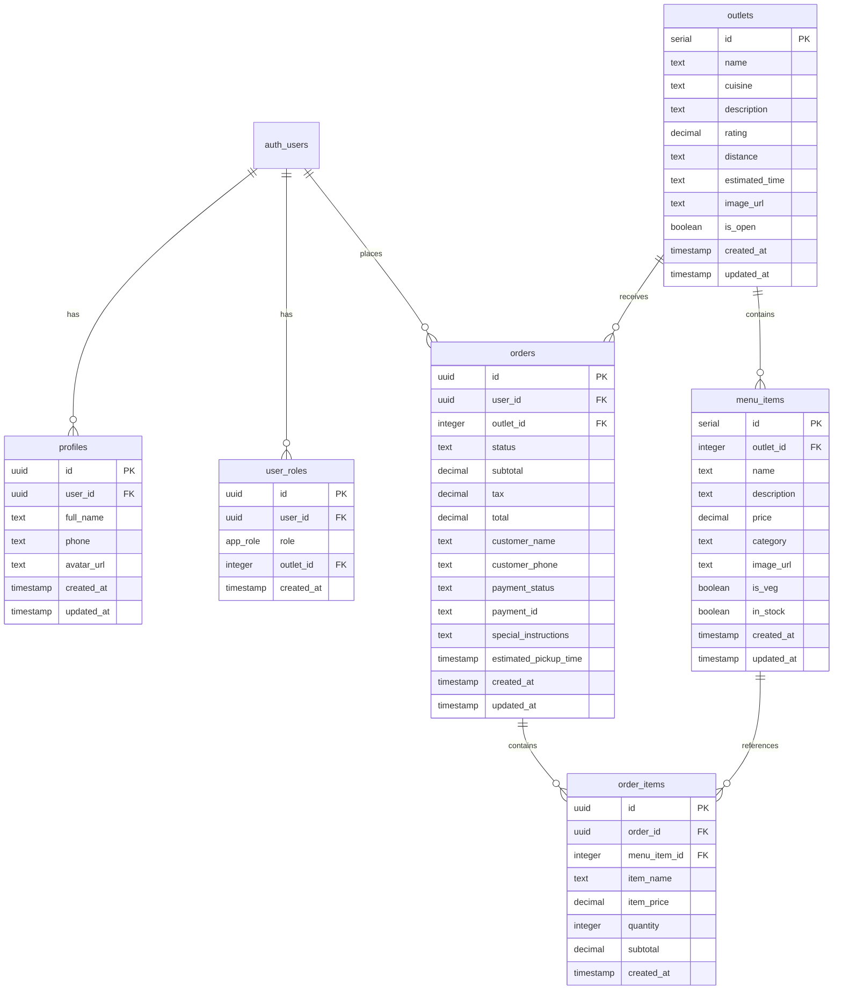

# GrabNGo Backend Documentation

## Overview

This document explains the complete backend architecture for the GrabNGo food ordering application. The system uses **Supabase (PostgreSQL)** instead of Firebase/Firestore, providing a more powerful and scalable solution.

## Architecture Comparison: Firebase vs Supabase

| Feature | Firebase (Requested) | Supabase (Implemented) |
|---------|---------------------|------------------------|
| Database | Firestore (NoSQL) | PostgreSQL (SQL) |
| Real-time | Firestore listeners | PostgreSQL Realtime subscriptions |
| Backend Functions | Cloud Functions | Edge Functions (Deno) |
| Authentication | Firebase Auth | Supabase Auth |
| Payments | Manual Razorpay integration | Stripe integration (built-in) |

## Database Schema

### Tables Overview



### 1. **profiles** - User Information
Stores additional user profile data beyond authentication.

```sql
CREATE TABLE public.profiles (
  id UUID PRIMARY KEY DEFAULT gen_random_uuid(),
  user_id UUID REFERENCES auth.users(id) UNIQUE NOT NULL,
  full_name TEXT,
  phone TEXT,
  avatar_url TEXT,
  created_at TIMESTAMP WITH TIME ZONE DEFAULT NOW(),
  updated_at TIMESTAMP WITH TIME ZONE DEFAULT NOW()
);
```

### 2. **user_roles** - Role-Based Access Control
Manages user roles for security and permissions (stored separately for security).

```sql
CREATE TYPE public.app_role AS ENUM ('customer', 'vendor_staff', 'admin');

CREATE TABLE public.user_roles (
  id UUID PRIMARY KEY DEFAULT gen_random_uuid(),
  user_id UUID REFERENCES auth.users(id) NOT NULL,
  role app_role NOT NULL,
  outlet_id INTEGER,  -- Links vendor staff to specific outlet
  created_at TIMESTAMP WITH TIME ZONE DEFAULT NOW(),
  UNIQUE (user_id, role, outlet_id)
);
```

### 3. **outlets** - Food Outlets/Vendors
Stores information about campus food outlets.

```sql
CREATE TABLE public.outlets (
  id SERIAL PRIMARY KEY,
  name TEXT NOT NULL,
  cuisine TEXT,
  description TEXT,
  rating DECIMAL(2,1) DEFAULT 0.0,
  distance TEXT,
  estimated_time TEXT,
  image_url TEXT,
  is_open BOOLEAN DEFAULT true,
  created_at TIMESTAMP WITH TIME ZONE DEFAULT NOW(),
  updated_at TIMESTAMP WITH TIME ZONE DEFAULT NOW()
);
```

### 4. **menu_items** - Menu Items
Stores menu items for each outlet.

```sql
CREATE TABLE public.menu_items (
  id SERIAL PRIMARY KEY,
  outlet_id INTEGER REFERENCES public.outlets(id) NOT NULL,
  name TEXT NOT NULL,
  description TEXT,
  price DECIMAL(10,2) NOT NULL,
  category TEXT,
  image_url TEXT,
  is_veg BOOLEAN,
  in_stock BOOLEAN DEFAULT true,
  created_at TIMESTAMP WITH TIME ZONE DEFAULT NOW(),
  updated_at TIMESTAMP WITH TIME ZONE DEFAULT NOW()
);
```

### 5. **orders** - Order Information (equivalent to Firestore Orders collection)
Main orders table with all order details.

```sql
CREATE TABLE public.orders (
  id UUID PRIMARY KEY DEFAULT gen_random_uuid(),
  user_id UUID REFERENCES auth.users(id),
  outlet_id INTEGER REFERENCES public.outlets(id) NOT NULL,
  status TEXT NOT NULL DEFAULT 'placed' CHECK (status IN ('placed', 'preparing', 'ready', 'completed', 'cancelled')),
  subtotal DECIMAL(10,2) NOT NULL,
  tax DECIMAL(10,2) DEFAULT 0,
  total DECIMAL(10,2) NOT NULL,
  customer_name TEXT NOT NULL,
  customer_phone TEXT NOT NULL,
  payment_status TEXT DEFAULT 'pending' CHECK (payment_status IN ('pending', 'paid', 'failed')),
  payment_id TEXT,
  special_instructions TEXT,
  estimated_pickup_time TIMESTAMP WITH TIME ZONE,
  created_at TIMESTAMP WITH TIME ZONE DEFAULT NOW(),
  updated_at TIMESTAMP WITH TIME ZONE DEFAULT NOW()
);
```

### 6. **order_items** - Individual Order Items
Stores the line items for each order.

```sql
CREATE TABLE public.order_items (
  id UUID PRIMARY KEY DEFAULT gen_random_uuid(),
  order_id UUID REFERENCES public.orders(id) NOT NULL,
  menu_item_id INTEGER REFERENCES public.menu_items(id),
  item_name TEXT NOT NULL,
  item_price DECIMAL(10,2) NOT NULL,
  quantity INTEGER NOT NULL CHECK (quantity > 0),
  subtotal DECIMAL(10,2) NOT NULL,
  created_at TIMESTAMP WITH TIME ZONE DEFAULT NOW()
);
```

## Row Level Security (RLS) Policies

All tables have RLS enabled with the following security model:

- **Customers** can only view/manage their own orders
- **Vendor staff** can view/update orders for their assigned outlet
- **Admins** can manage everything
- Public read access for outlets and menu items

## Edge Functions (equivalent to Cloud Functions)

### 1. **place-order** - Place New Order

**Endpoint:** `https://jqthuwrklpuiiucfeozn.supabase.co/functions/v1/place-order`

**Purpose:** Validates cart data, calculates prices, and creates order in database.

**Request:**
```typescript
{
  outlet_id: number;
  items: Array<{
    menu_item_id: number;
    quantity: number;
  }>;
  customer_name: string;
  customer_phone: string;
  special_instructions?: string;
}
```

**Response:**
```typescript
{
  success: true;
  order: {
    id: string;
    total: string;
    status: string;
    estimated_pickup_time: string;
  };
  message: string;
}
```

**Security:**
- Requires authentication
- Validates all menu items belong to the specified outlet
- Checks stock availability
- Calculates server-side pricing (cannot be manipulated)
- Applies 5% tax rate

**Frontend Usage:**
```typescript
import { supabase } from '@/integrations/supabase/client';

const placeOrder = async (orderData) => {
  const { data, error } = await supabase.functions.invoke('place-order', {
    body: orderData
  });
  
  if (error) {
    console.error('Error placing order:', error);
    return;
  }
  
  console.log('Order placed successfully:', data);
  return data.order;
};
```

### 2. **update-order-status** - Update Order Status

**Endpoint:** `https://jqthuwrklpuiiucfeozn.supabase.co/functions/v1/update-order-status`

**Purpose:** Allows vendor staff to update order status with proper authorization.

**Request:**
```typescript
{
  order_id: string;
  new_status: 'placed' | 'preparing' | 'ready' | 'completed' | 'cancelled';
}
```

**Response:**
```typescript
{
  success: true;
  order: Order;
  message: string;
}
```

**Security:**
- Requires authentication
- **Vendor staff**: Can update any status for their outlet's orders
- **Customers**: Can only cancel their own orders (if status is 'placed' or 'preparing')
- Validates user has permission for the specific outlet

**Frontend Usage:**
```typescript
const updateOrderStatus = async (orderId: string, newStatus: string) => {
  const { data, error } = await supabase.functions.invoke('update-order-status', {
    body: {
      order_id: orderId,
      new_status: newStatus
    }
  });
  
  if (error) {
    console.error('Error updating status:', error);
    return;
  }
  
  console.log('Status updated:', data);
};
```

## Real-Time Updates (equivalent to Firestore listeners)

Supabase provides PostgreSQL real-time subscriptions that work similarly to Firestore listeners.

### Subscribe to a Single Order

```typescript
import { useRealtimeOrder } from '@/hooks/useRealtimeOrders';

function OrderTrackingPage({ orderId }) {
  const { order, loading, error } = useRealtimeOrder(orderId);
  
  // Order automatically updates when status changes!
  return (
    <div>
      <h2>Order Status: {order?.status}</h2>
      <p>Estimated Pickup: {order?.estimated_pickup_time}</p>
    </div>
  );
}
```

### Subscribe to All User Orders

```typescript
import { useRealtimeUserOrders } from '@/hooks/useRealtimeOrders';

function MyOrdersPage() {
  const { orders, loading, error } = useRealtimeUserOrders();
  
  return (
    <div>
      {orders.map(order => (
        <OrderCard key={order.id} order={order} />
      ))}
    </div>
  );
}
```

### Subscribe to Outlet Orders (Vendor Console)

```typescript
import { useRealtimeOutletOrders } from '@/hooks/useRealtimeOrders';

function VendorConsole({ outletId }) {
  const { orders, loading, error } = useRealtimeOutletOrders(outletId);
  
  // New orders automatically appear!
  return (
    <div>
      {orders.map(order => (
        <OrderCard 
          key={order.id} 
          order={order}
          onStatusChange={(newStatus) => 
            updateOrderStatus(order.id, newStatus)
          }
        />
      ))}
    </div>
  );
}
```

## Payment Integration

### Stripe (Recommended)

Lovable has a built-in Stripe integration. To enable:

1. Enable Stripe in your project settings
2. Add your Stripe secret key
3. Use the Stripe checkout in your frontend

### Razorpay (Alternative)

If you prefer Razorpay:

1. Add Razorpay secret keys using the secrets tool
2. Create an edge function to initialize Razorpay orders
3. Verify payment on the backend before marking order as paid

## Security Best Practices

### ✅ Implemented Security Features:

1. **Row Level Security (RLS)** on all tables
2. **Role-based access control** with separate user_roles table
3. **Server-side price calculation** (cannot be manipulated)
4. **Vendor staff authorization** (must be assigned to outlet)
5. **Security definer functions** to prevent RLS recursion
6. **Input validation** in edge functions
7. **Authentication required** for all sensitive operations

### ⚠️ Important Security Notes:

- Roles are stored in a separate table (not in profiles) to prevent privilege escalation
- All price calculations happen server-side
- Real-time subscriptions automatically respect RLS policies
- Edge functions validate permissions before database writes

## Testing the System

### 1. Place an Order (Customer)

```bash
curl -X POST 'https://jqthuwrklpuiiucfeozn.supabase.co/functions/v1/place-order' \
  -H "Authorization: Bearer YOUR_USER_TOKEN" \
  -H "Content-Type: application/json" \
  -d '{
    "outlet_id": 1,
    "items": [
      {"menu_item_id": 1, "quantity": 2},
      {"menu_item_id": 2, "quantity": 1}
    ],
    "customer_name": "John Doe",
    "customer_phone": "9876543210"
  }'
```

### 2. Update Order Status (Vendor Staff)

```bash
curl -X POST 'https://jqthuwrklpuiiucfeozn.supabase.co/functions/v1/update-order-status' \
  -H "Authorization: Bearer VENDOR_STAFF_TOKEN" \
  -H "Content-Type: application/json" \
  -d '{
    "order_id": "order-uuid-here",
    "new_status": "preparing"
  }'
```

## Database Setup Steps

1. ✅ Database schema created
2. ✅ RLS policies configured
3. ✅ Real-time subscriptions enabled
4. ✅ Edge functions deployed
5. ✅ Security functions created
6. 🔄 Seed data (optional - add sample outlets and menu items)

## Next Steps

1. **Enable Stripe** for payment processing (recommended)
2. **Seed sample data** in outlets and menu_items tables
3. **Assign vendor staff roles** to test accounts
4. **Test real-time updates** with multiple browser windows
5. **Deploy to production** when ready

## Comparison with Firebase Approach

| Task | Firebase | Supabase (Implemented) |
|------|----------|------------------------|
| Database queries | Firestore SDK | Supabase client (SQL) |
| Real-time updates | `onSnapshot()` | `channel().on()` |
| Security rules | Firestore rules | RLS policies |
| Backend functions | Cloud Functions (Node.js) | Edge Functions (Deno) |
| Authentication | Firebase Auth | Supabase Auth |
| Cost model | Pay per read/write | Flat rate per project |
| Data structure | NoSQL (flexible) | SQL (structured) |
| Complex queries | Limited | Full SQL support |

## Advantages of This Approach

1. **Full SQL Support**: Complex joins, aggregations, transactions
2. **Better Performance**: PostgreSQL is faster for complex queries
3. **Type Safety**: Generated TypeScript types from schema
4. **Cheaper at Scale**: Flat pricing vs per-operation
5. **Open Source**: Can self-host if needed
6. **Modern Stack**: Deno for edge functions (faster, more secure)
7. **Built-in Integrations**: Stripe, OAuth, etc.

---

For questions or issues, refer to:
- [Supabase Documentation](https://supabase.com/docs)
- [Supabase Realtime Guide](https://supabase.com/docs/guides/realtime)
- [Edge Functions Guide](https://supabase.com/docs/guides/functions)
